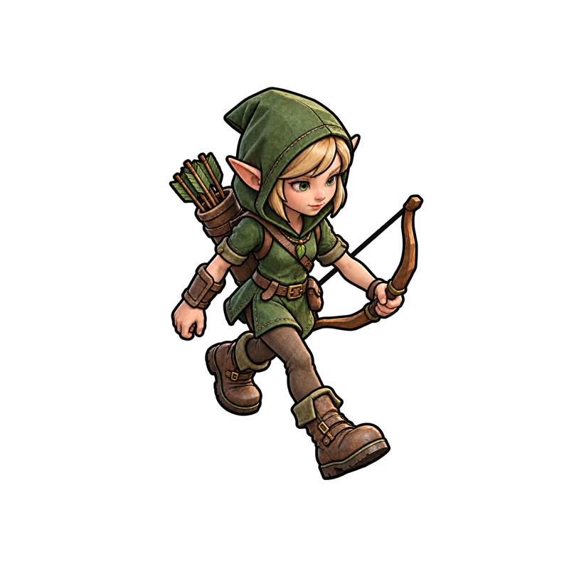
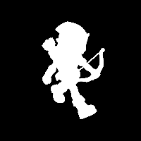
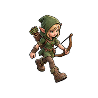
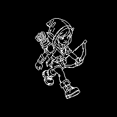
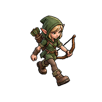
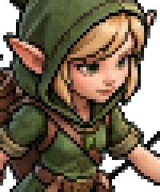
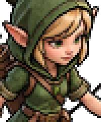

# asset-scaler

Shared contour-aware **Game Asset** downscaler for Diorama and Sprite Studio
(the `spritesheet` repository). Rust 1.92+, GPL-3.0-only.

The implementation was extracted from Diorama's Game Asset renderer and compared
with Sprite Studio's port. Both applications now consume this crate rather than
maintaining separate algorithms. Source analysis, direction-merged contours,
source-width ink opacity, premultiplied linear Lanczos3 fill, bounded halo
correction, and adjustable antialiasing live here.

## From illustration to a 200×200 sprite

The elf below starts at **800×800** with a transparent background. Every
intermediate and output panel is generated by this crate at **200×200**;
only the source preview is displayed smaller than its original resolution.
Click the source to view the full image.

| Source · 800×800 | Extracted contours · 200×200 | Fill mask · 200×200 |
| :---: | :---: | :---: |
| <a href="docs/images/elf-source.png"></a> |  |  |

1. **Find and retain contours.** Detect dark ridges in the source, fit curves,
   thin their rasterization, and join compatible continuations. At the target
   size, discard very short contours and smooth the retained curves. The
   contour panel shows their target-resolution digital cores, before AA or
   source-width opacity is applied; it is not a complete silhouette outline.
2. **Keep the silhouette.** For this transparent asset, source alpha determines
   the character's shape. The fill mask shows target silhouette coverage at
   50% AA: white is covered, black is exterior, and gray is partial coverage.
   Internal contours do not punch holes through the character.
3. **Resample the color.** Convert to linear light and resize premultiplied RGBA
   with Lanczos3. The fill preview below is this color resample, before bounded
   halo correction and final silhouette coverage. Original painted lines remain
   part of the sampled color; this is not an inpainted, line-free layer.
4. **Compose the sprite.** Correct halos near retained ink, apply silhouette
   coverage and intrinsic opacity, then blend sampled ink colors using contour
   AA coverage and the measured source stroke widths. Convert back to sRGB.

| Resampled color fill | Contour AA coverage · 50% | Composed sprite · 50% |
| :---: | :---: | :---: |
|  |  |  |

## Antialiasing comparison

AA controls the contour treatment and silhouette edge coverage, rather than
blurring the whole sprite. **0%** gives hard contour coverage, **50%** is the
default, and **100%** applies the strongest supported AA. Color resampling and
source-width ink opacity still operate at 0%, so it does not restrict the
result to a binary palette or binary alpha.

| AA 0% | AA 50% · default | AA 100% |
| :---: | :---: | :---: |
|  |  |  |
|  |  |  |

The second row shows the same 50×60 crop enlarged **4× with nearest-neighbor**.
Image tags include `image-rendering: pixelated;`, but
[GitHub strips inline styles](https://github.com/github/markup#github-markup).
The enlarged crops therefore have their pixel blocks baked into the PNGs.

## Usage

Resize a PNG at the default 50% AA:

```sh
cargo run --release -p asset-scaler --example resize -- input.png output.png 200 200
```

Choose an AA setting in Rust (enable the `image` crate's `png` feature for file I/O):

```rust,no_run
use asset_scaler::{CancellationToken, GameAssetAa, resize};

let source = image::open("input.png")?.into_rgba8();
let small = resize(
    &source, 200, 200, GameAssetAa::new(50), &CancellationToken::default(),
)?;
small.save("output.png")?;
# Ok::<(), Box<dyn std::error::Error>>(())
```

`resize` borrows a source for single-shot frame processing. `Session` owns an
`Arc<RgbaImage>` and caches source analysis and one output for interactive
previews. Both run the same algorithm. Dimensions must be nonzero and no larger
than the source on either axis; enlargement belongs to the host application.
AA is clamped to 0–100%, defaulting to 50%.

For several sizes or AA settings of the same source, reuse its analysis:

```rust,no_run
use asset_scaler::{CancellationToken, GameAssetAa, Session};
use std::sync::Arc;

let source = image::open("input.png")?.into_rgba8();
let session = Session::new(Arc::new(source));
let cancel = CancellationToken::default();
for aa in [0, 50, 100] {
    let sprite = session.resize(200, 200, GameAssetAa::new(aa), &cancel)?;
    sprite.save(format!("elf-aa-{aa}.png"))?;
}
# Ok::<(), Box<dyn std::error::Error>>(())
```

`Cancellation` accepts native tokens or `Sync` closures, for example
`&|| tokio_token.is_cancelled()`. Cancellation is checked even for identity and
cached requests. `resize_with_memory_limit` and `Session::with_memory_limit`
allow callers to preserve their own working-set limits (Sprite Studio uses
1 GiB, Diorama 4 GiB). This is a conservative preflight estimate, not an OS
allocation quota.

## Silhouette fixes

Explicit source alpha owns transparent asset geometry. Internal color ridges
must not carve holes into opaque source-supported boots or limbs. Opaque,
flat-background thin components without a reliable fill interior retain their
terminal rows. Regression tests cover both cases, including the previously
ignored off-grid-line test in Sprite Studio. Background removal itself is a
separate operation and is not performed by this crate.

## HTTP asset processor

This workspace also contains `asset-background-removal` and the
`asset-scaler-server` loopback service, which combines it with the scaler for
shared local asset processing. See the [server guide](docs/asset-scaler-server.md)
for the command, HTTP API, limits, runtime setup, and compatibility environment
variables.

## Development

```sh
cargo test --workspace --all-targets
cargo test --workspace --doc
cargo clippy --workspace --all-targets -- -D warnings
cargo fmt --all -- --check
cargo run --example resize -- input.png output.png 200 200
```

Regenerate the README panels from the checked-in elf source:

```sh
cargo test -p asset-scaler --release --lib generate_readme_images -- --ignored
```

The manual exporter in `src/readme_images.rs` calls the same private stages as
the renderer and writes the PNGs in `docs/images/`. See the
[image notes](docs/images/README.md) for the exact intermediate data and crop.

Keep `Cargo.lock` committed for repeatable CI. The applications initially pin a
Git revision of this repository; update both pins together after a shared fix.
For local development, Cargo's `--config` can patch the Git dependency to the
sibling checkout without committing an absolute path into either application.

## GitHub identity

Origin: `https://github.com/mendrik-private/asset-scaler.git`.
After cloning, run `scripts/configure-git-identity.sh`. It configures **only this
repository** with the `mendrik-private` commit identity and a credential helper
that explicitly reads that account from `gh`, ignoring globally active accounts
and environment tokens. It fails if that account is unavailable; it never falls
back to another account. Tokens are not stored in this repository.

## Publishing

`.github/workflows/publish.yml` publishes a matching `v<VERSION>` tag pushed by
`mendrik-private`, after formatting, Clippy, tests and packaging pass. Manual
reruns must also select that tag. After bootstrap, publishing uses short-lived
[crates.io trusted-publishing tokens](https://github.com/rust-lang/crates-io-auth-action),
not the GitHub credential helper.

For the first publication, set the `CARGO_REGISTRY_TOKEN` secret on the
`crates-io` GitHub environment to a crates.io token from the intended owner
account, scoped to publishing `asset-scaler`. The workflow uses that token when
present, so it can bootstrap a new crate. GitHub credentials are not crates.io
credentials.

Once the crate exists, register its trusted publisher for owner
`mendrik-private`, repository `asset-scaler`, workflow `publish.yml`, environment
`crates-io`, then remove the bootstrap secret. Subsequent releases use OIDC.
Only push a matching `v<VERSION>` tag when ready to publish; no release tag or
actual crates.io publication is performed by extraction/setup.

See the [Cargo publishing guide](https://doc.rust-lang.org/cargo/reference/publishing.html).
